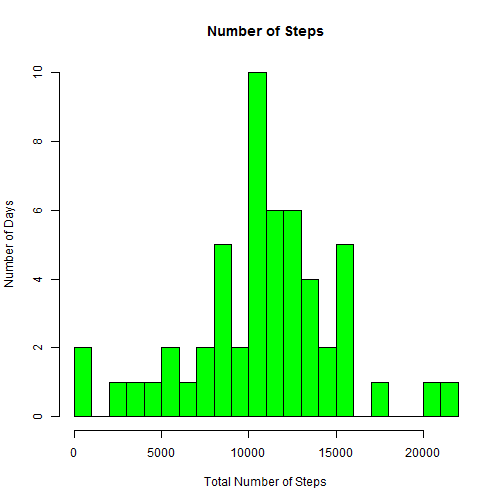
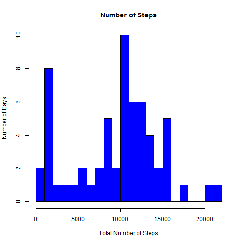
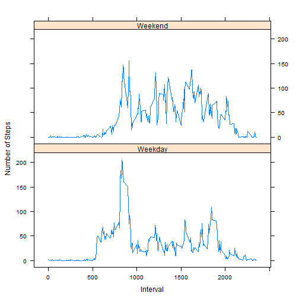

ACTIVITIES FILES , MY FIRST KNITR ASSIGNMENT
=================================================================

## Loading and preprocessing the data
Here is code chunk, we will first read the file and remove the NA values

```r
library(ggplot2)
library(knitr)
activities <- read.csv("activity.csv", stringsAsFactors = FALSE)
activities_f <-subset(activities, is.na(activities$steps)==F) 
```

## What is mean total number of steps taken per day?

### 1. Calculate the total number of steps taken per day and plot a histogram


```r
activities_f$date <- as.Date(activities_f$date)
res <-aggregate(activities_f$steps, by=list(activities_f$date), sum)

colnames(res)<-c("Date" ,"Total Steps")
hist(res$`Total Steps`, breaks = 20, main ="Number of Steps", xlab = "Total Number of Steps", ylab="Number of Days", col="green")
```




### 2. Calculate and report the mean and median of the total number of steps taken per day


```r
mean(res$`Total Steps`)
```

```
## [1] 10766.19
```

```r
median(res$`Total Steps`)
```

```
## [1] 10765
```

## What is the average daily activity pattern?
### Create a plot with Interval on X-Axis and Average number of steps on Y axis, label them appropriately

```r
res2 <-aggregate(activities_f$steps, by=list(activities_f$interval), mean)

colnames(res2)<-c("Interval" ,"Mean_steps_on_all_dates")

plot(res2$Interval, res2$Mean_steps_on_all_dates,axes = F, type = "l", xlab="Time", ylab="Average Number of Steps")
axis(1,at=c(0,500,1000,1500,2000),label = c("0:00","6:00","12:00","18:00","24:00"))
axis(2)
```


### Which 5-minute interval, on average across all the days in the dataset, contains the maximum number of steps?


```r
res2[which.max(res2$Mean_steps_on_all_dates),]
```

```
##     Interval Mean_steps_on_all_dates
## 104      835                206.1698
```
Imputing missing values
==============================================================
## 1. Calculate and report the total number of missing values in the dataset (i.e. the total number of rows with NAs)
==============================================================

```r
sum(is.na(activities$steps))
```

```
## [1] 2304
```

## 1. Devise a strategy for filling in all of the missing values in the dataset. The strategy does not need to be sophisticated. For example, you could use the mean/median for that day, or the mean for that 5-minute interval, etc.

==============================================================

### I will fill NA with Median value for that 5 min Interval


```r
res_median <-aggregate(activities_f$steps, by=list(activities_f$interval), median)
colnames(res_median)<-c("interval" ,"Median_steps_on_all_dates")
```

## 3. Create a new dataset that is equal to the original dataset but with the missing data filled in.
==============================================================

```r
join_res <- join(activities, res_median, by="interval", type="inner") 

join_res$steps <-with(join_res,   ifelse(is.na(join_res$steps),Median_steps_on_all_dates,steps))
```

## 4. Make a histogram of the total number of steps taken each day and Calculate and report the mean and median total number of steps taken per day. Do these values differ from the estimates from the first part of the assignment? What is the impact of imputing missing data on the estimates of the total daily number of steps?


```r
totstepeachday <-aggregate(join_res$steps, by=list(join_res$date), sum)

colnames(totstepeachday)<-c("Date" ,"Total Steps Each Day")

hist(totstepeachday$`Total Steps Each Day`, breaks = 20, 
     main="Number of Steps",xlab = "Total Number of Steps", ylab="Number of Days",col="blue")
```



### Calculate and report the mean and median total number of steps taken per day


```r
mean(totstepeachday$`Total Steps Each Day`)
```

```
## [1] 9503.869
```

```r
median(totstepeachday$`Total Steps Each Day`)
```

```
## [1] 10395
```

Test if imputed values are different from first one's

```r
abs(mean(res$`Total Steps`)-mean(totstepeachday$`Total Steps Each Day`))
```

```
## [1] 1262.32
```

```r
abs(median(res$`Total Steps`)- median(totstepeachday$`Total Steps Each Day`))/median(res$`Total Steps`)
```

```
## [1] 0.03437065
```

```r
Total_diff<-sum(join_res$steps)-sum(activities_f$steps)
Total_diff
```

```
## [1] 9128
```

Are there differences in activity patterns between weekdays and weekends?
==============================================================

## 1.Create a new factor variable in the dataset with two levels - "weekday" and "weekend" indicating whether a given date is a weekday or weekend day.


```r
join_res$weekday <- weekdays(as.Date(join_res$date))
join_res$weekday_1<- ifelse(join_res$weekday %in% c("Saturday","Sunday"), "Weekend", "Weekday")
```

## 2. Make a panel plot containing a time series plot (i.e. type = "l") of the 5-minute interval (x-axis) and the average number of steps taken, averaged across all weekday days or weekend days (y-axis). See the README file in the GitHub repository to see an example of what this plot should look like using simulated data.


```r
library(lattice)
xyplot( mean_steps~Interval|Weekday, data=avg, layout =c(1,2), type="l", xlab="Interval", ylab = "Number of Steps")
```


